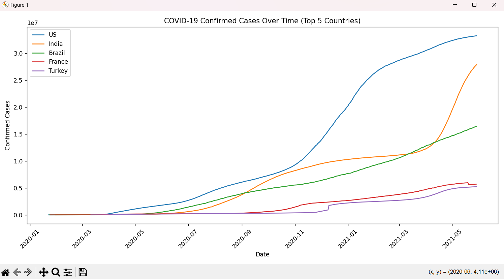
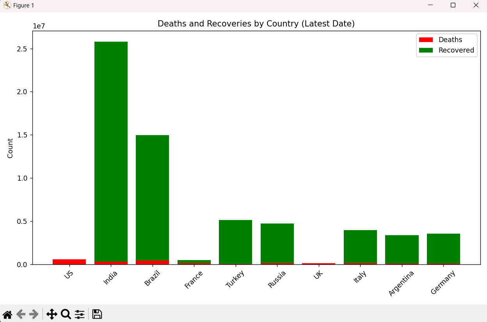
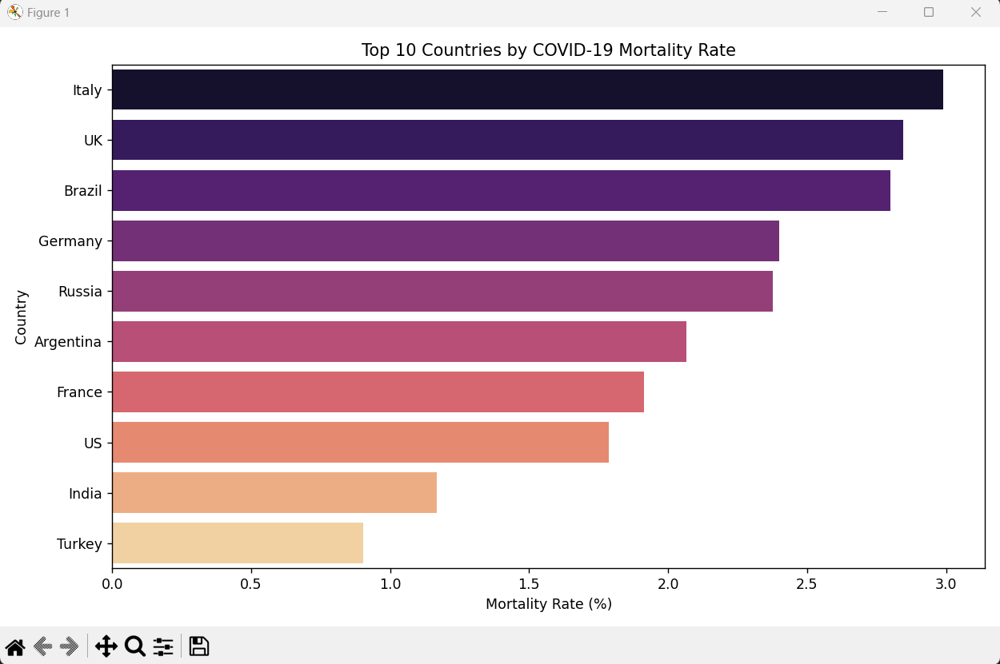

# 🦠 COVID-19 Data Analysis & Visualization

This is a simple data analysis project where I explored COVID-19 global trends using Python. The main idea was to take raw data from the pandemic and turn it into visual insights—things like how cases evolved over time, how different countries were impacted, and what the mortality rates looked like.

I used basic data science tools like Pandas, Matplotlib, and Seaborn—no machine learning or heavy stuff, just clean code and useful charts.


## 🧾 What This Project Includes

- 📅 Trend of confirmed cases over time (Top 5 countries)
- 📊 Deaths vs Recoveries (Latest available date)
- 💀 Mortality rate comparison between the top affected countries
- 📁 Final summary saved as a CSV file for reference


## 📊 Visuals Included

### 1. Confirmed Cases Over Time
Shows how the pandemic evolved in the 5 most affected countries.


### 2. Deaths vs Recoveries (Top 10 Countries)
Stacked bar chart showing how many people recovered vs. died.


### 3. Mortality Rate by Country
How deadly was the virus in different countries.



## 📁 Files in This Repo

```bash
📦 covid19-analysis-manav
 ┣ 📄 covid19_analysis_manav.py         # The main script
 ┣ 📄 covid_final_summary.csv           # Final summary of latest data
 ┣ 📄 README.md                          # You’re reading it!
 ┣ 📷 Confirmed_Case.png
 ┣ 📷 Deaths_and_Recoveries.png
 ┣ 📷 Mortality_Rate.png
 ┗ 📷 Terminal.png                       # Screenshot of initial output

🛠️ Tools I Used
Python 3
Pandas
Matplotlib
Seaborn

If you're into data science or just want to practice visualization, this is a good starter.

🧪 How to Run It
Make sure you have Python installed. Then:
git clone https://github.com/your-username/covid19-analysis-manav.git
cd covid19-analysis-manav
pip install pandas matplotlib seaborn
python covid19_analysis_manav.py
It'll generate all the plots and save the final summary file.

📌 Dataset Info
I used a public COVID-19 dataset from Kaggle, which contains global daily updates of confirmed cases, deaths, and recoveries.

✍️ About Me
I'm Manav Poojari, currently learning and experimenting with data analytics, visualization, and real-world datasets like this. This project was built to understand how simple tools can give us meaningful insights.

📝 License
This project is free to use for learning or personal work. Credit goes to the original data providers.

Thanks for checking this out! Feel free to fork or star ⭐ the repo if you find it helpful.
